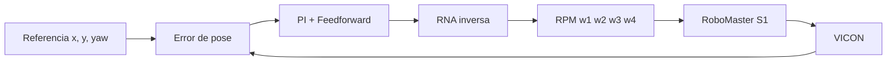

# Control en lazo cerrado

## Idea general

Después de entrenar las redes, el objetivo fue utilizar la RNA inversa como parte de un controlador físico.

El ciclo implementado es:

`VICON → pose actual → error → controlador → RNA inversa → RPM → RoboMaster`

y nuevamente:

`RoboMaster → VICON`

Este lazo se ejecuta aproximadamente cada 0.05 s, es decir, a 20 Hz.

## Control de posición

En cada iteración se obtiene:

`pose_actual = [x, y, yaw]`

y se compara con:

`pose_deseada = [x_d, y_d, yaw_d]`

Se calcula el error global de posición y orientación. Después, el error en X/Y se transforma al marco local del robot.

El controlador utiliza el error entre la posición actual y la posición deseada para calcular el movimiento que debe realizar el robot. Para ello combina una acción proporcional, que corrige el error de posición, y una acción integral limitada, que ayuda a reducir pequeños errores que pueden mantenerse con el tiempo. También se considera el error de orientación del robot.

Cuando se sigue una trayectoria, además de corregir el error de posición, se utiliza como referencia la velocidad que debería llevar el robot en cada instante. Esta información funciona como un término de *feedforward*, es decir, permite anticipar parte del movimiento necesario en lugar de esperar a que aparezca un error.

La velocidad deseada obtenida por el controlador se transforma en los comandos de las cuatro ruedas mediante la RNA inversa.

## Seguimiento de trayectoria

Durante el seguimiento, el controlador combina la velocidad de referencia de la trayectoria con la corrección basada en el error de posición:

`referencia de movimiento + corrección del error → RNA inversa → RPM de las ruedas`

Antes de enviar los comandos al RoboMaster, las RPM se limitan al rango permitido de ±120 RPM y se controlan los cambios bruscos entre un instante y el siguiente. Finalmente, los valores se envían a las cuatro ruedas mediante chassis.drive_wheels(...).

## Integración con VICON

Durante las primeras pruebas apareció un problema importante: VICON puede devolver una traslación [0, 0, 0] cuando el segmento se encuentra marcado como: Occluded = True

Si estos ceros se utilizaran como una pose real, el controlador asumiría incorrectamente que el robot está en el origen.

Por esta razón se modificó la lectura para:

1. Solicitar un nuevo frame;
2. Comprobar los indicadores de oclusión de posición y orientación;
3. Utilizar únicamente una pose con Occluded = False;
4. Abortar si después de varios intentos no se obtiene una medición válida.

Esta corrección fue necesaria antes de realizar las pruebas físicas finales.

## Referencia circular

La referencia original planteada fue:

`x(t) = 0.15 + 0.30 sin(2t)`

`y(t) = -0.20 + 0.30 cos(2t)`

Durante las primeras pruebas se observó que la velocidad exigida provocaba saturación frecuente de los comandos en ±120 RPM.

Para la validación física se utilizó una referencia con la misma estructura, pero más adecuada para observar el comportamiento real:

- Centro:(0.15, -0.20) m;
- Radio: 0.40 m;
- Velocidad angular reducida: aproximadamente 1.3 rad/s.

La referencia experimental fue:

`x(t) = 0.15 + 0.40 sin(1.3t)`

`y(t) = -0.20 + 0.40 cos(1.3t)`

Su punto inicial es: (0.15, 0.20) m

Por ello, antes de ejecutar el círculo el robot se llevó a esa coordenada mediante el modo de generación de trayectorias.
